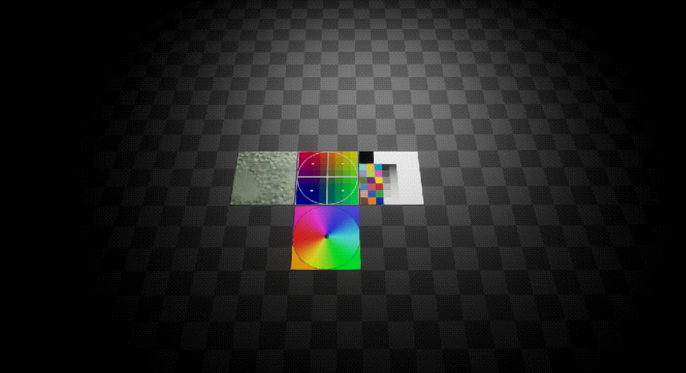
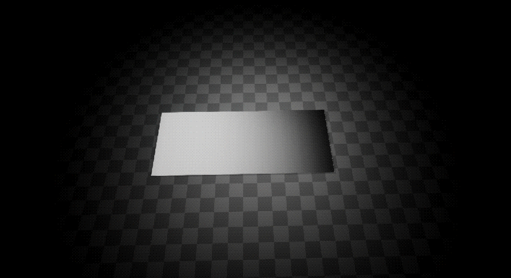
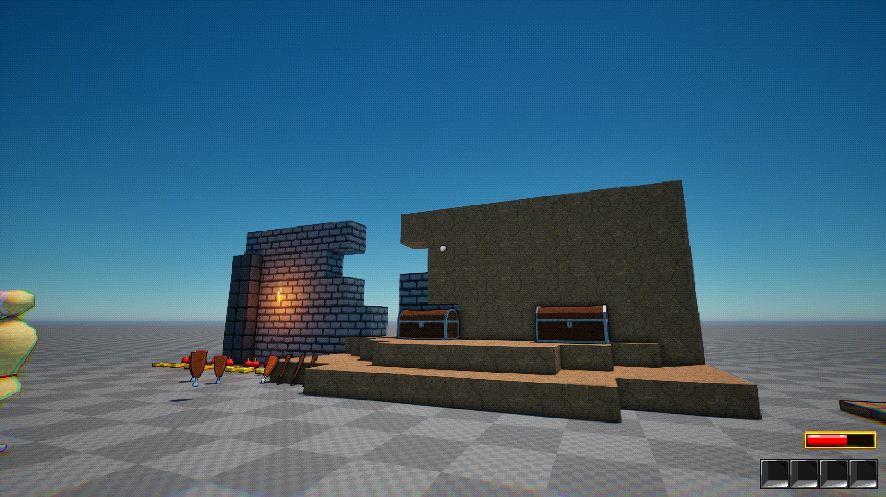

# Retro Dither Post Process – Unreal Engine 5.6

A stylized post-process material created in Unreal Engine 5.6 that simulates retro console-style color reduction using ordered dithering and pixelated mosaic sampling.

This repository showcases the visual result and technical breakdown.
Source code is intentionally not included.

---

## Features

- Resolution-aware mosaic UV snapping
- Ordered dithering (texture-based threshold)
- Adjustable color quantization levels
- Retro-inspired posterization look
- Fully dynamic (works with real-time lighting)

---

## 📷 Preview

### image1

### image2

### image3

